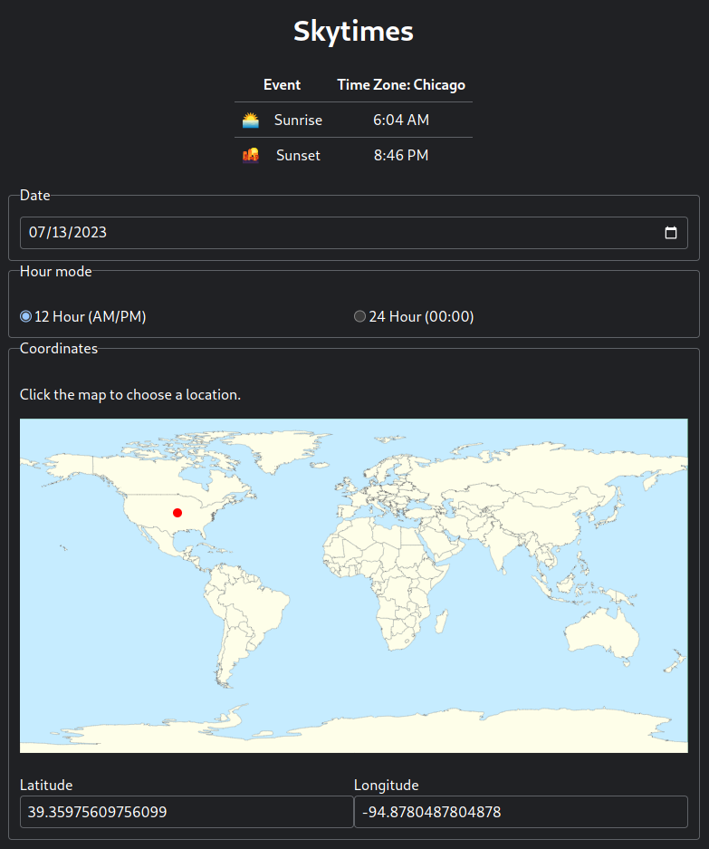

# Skytimes

A minimal web application which calculates sunset & sunrise times for
locations around the world. The front end communicates with the API 
via JSON fetch requests.

## Project Goals

- [x] Demonstrate practical knowledge of HTML, CSS, XML, and JSON
- [x] Learn about modern JavaScript techniques

## Screenshot

## Usage

1. `pip install .`
2. On Linux and Mac, use `./launch.sh` to launch the server. Use `uvicorn app:app --reload` on Windows.
3. Open https://localhost:8000/ in your browser

## Asset Credits

| Component                 | Purpose                             | License                  | Project or Source URL                                                      |
|---------------------------|-------------------------------------|--------------------------|----------------------------------------------------------------------------|
| Equirectilinear World Map | The map used for location selection | Public Domain Dedication | https://upload.wikimedia.org/wikipedia/commons/a/ac/World_location_map.svg |
